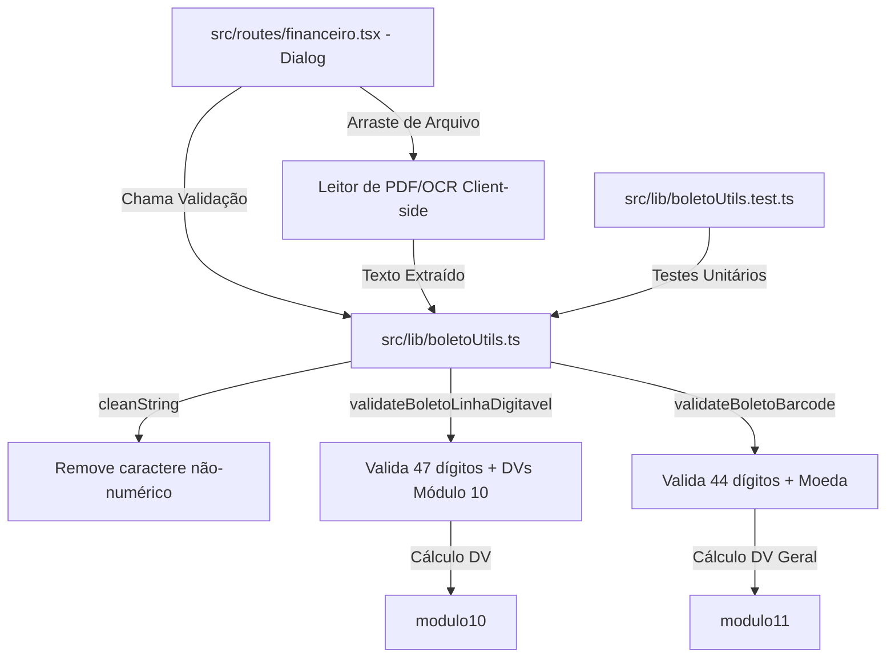

# Especificação Funcional e Técnica: Validação e Checagem de Boletos

## 1. Identificação do Documento
* **Título:** Especificação Funcional e Técnica - Módulo de Checagem de Boletos
* **Área:** Sistema Financeiro (Contas a Pagar / Receber)
* **Status:** Rascunho Inicial (Para Implementação e Revisão)
* **Versão:** 1.0.0
* **Data:** 18 de Julho de 2026

---

## 2. Introdução e Objetivos

Este documento especifica os requisitos funcionais, as regras de negócios e a lógica de implementação técnica para o módulo de **Validação e Checagem de Boletos** no sistema financeiro. 

O objetivo do módulo é permitir que os usuários verifiquem a validade física e lógica de boletos de cobrança e contas de consumo (tributos/concessionárias) a partir do **Código de Barras** ou da **Linha Digitável**, mitigando erros de digitação e fraudes antes do agendamento ou pagamento.

---

## 3. Tipos de Boletos no Mercado Brasileiro

O sistema financeiro precisa suportar os dois principais padrões regulamentados pelo Banco Central do Brasil e pela FEBRABAN:

### 3.1. Boletos de Cobrança Registrada (Boleto Bancário)
Utilizados para cobranças comerciais gerais (ex: faturas de serviços, mensalidades, e-commerce).
* **Tamanho do Código de Barras:** 44 dígitos numéricos.
* **Tamanho da Linha Digitável:** 47 dígitos numéricos (divididos em 5 blocos).
* **Estrutura de Moeda:** Geralmente `9` (Real).

### 3.2. Boletos de Concessionárias / Tributos (Contas de Consumo)
Utilizados para pagamento de serviços públicos (água, luz, telefone, gás) e impostos (IPTU, IPVA, GRU, etc.).
* **Tamanho do Código de Barras:** 48 dígitos numéricos (iniciando com o dígito `8`).
* **Tamanho da Linha Digitável:** 48 dígitos numéricos (divididos em 4 blocos de 12 dígitos).

---

## 4. Regras de Negócio e Lógica de Validação

A validação consiste em três fases consecutivas: **Sanitização de Input**, **Validação Lógica de Dígitos Verificadores** e **Extração de Metadados**.

### 4.1. Sanitização de Entrada
Qualquer entrada do usuário deve ser limpa antes do processamento.
* **Ação:** Remover espaços, pontos, hífens, barras e qualquer caractere não numérico.
* **Expressão Regular:** `/[^\d]/g` ou `/\D/g`

```typescript
const cleanedInput = input.replace(/\D/g, '');
```

---

### 4.2. Boletos de Cobrança (44 / 47 Dígitos)

#### A. Estrutura do Código de Barras (44 dígitos)
O código de barras é estruturado da seguinte forma:
| Posição | Tamanho | Descrição |
|:---|:---|:---|
| 01 a 03 | 3 | Código do Banco (ex: `237` para Bradesco, `341` para Itaú) |
| 04 | 1 | Código de Moeda (`9` para Real, `0` para outras moedas) |
| 05 | 1 | Dígito Verificador Geral (DV) do Código de Barras |
| 06 a 09 | 4 | Fator de Vencimento |
| 10 a 19 | 10 | Valor Nominal do Boleto (com 2 casas decimais implícitas) |
| 20 a 44 | 25 | Campo Livre (dados específicos do banco emissor / beneficiário) |

#### B. Estrutura da Linha Digitável (47 dígitos)
Representação legível por humanos do código de barras. É dividida em 5 grupos:
1. **Grupo 1 (9 dígitos + DV1):** Três primeiros dígitos do código do banco + código da moeda + 5 primeiras posições do campo livre + Dígito Verificador do bloco (Módulo 10).
2. **Grupo 2 (10 dígitos + DV2):** Da 6ª à 15ª posição do campo livre + Dígito Verificador do bloco (Módulo 10).
3. **Grupo 3 (10 dígitos + DV3):** Da 16ª à 25ª posição do campo livre + Dígito Verificador do bloco (Módulo 10).
4. **Grupo 4 (1 dígito):** Dígito Verificador geral do Código de Barras (Módulo 11).
5. **Grupo 5 (14 dígitos):** Fator de vencimento (4 dígitos) + Valor nominal (10 dígitos).

#### C. Validação Matemática dos Blocos (Linha Digitável)
Cada um dos três primeiros grupos da Linha Digitável possui um dígito verificador calculado via **Módulo 10**:
* **Lógica Módulo 10:**
  1. Multiplica-se cada algarismo do grupo, da direita para a esquerda, alternadamente por 2 e por 1.
  2. Soma-se os algarismos dos produtos resultantes (se um produto for > 9, ex: 14, soma-se os algarismos: 1 + 4 = 5).
  3. Divide-se a soma por 10. O resto é subtraído de 10 para obter o DV. Se o resto for 0, o DV é 0.

#### D. Validação Geral do Código de Barras (DV Geral)
O DV Geral na posição 5 do código de barras é calculado através do **Módulo 11**:
* **Lógica Módulo 11:**
  1. Multiplica-se cada dígito do código de barras (exceto a posição 5 do DV) da direita para a esquerda por pesos de 2 a 9, reiniciando em 2 se ultrapassar 9.
  2. Soma-se o produto de todas as multiplicações.
  3. Divide-se a soma por 11. O resto é subtraído de 11.
  4. Se o resultado for 0, 10 ou 11, o dígito verificador geral assume o valor **1**.

#### E. Cálculo da Data de Vencimento (Fator de Vencimento)
O fator de vencimento é um número de 4 dígitos representando a quantidade de dias decorridos desde a data base estabelecida pelo Banco Central.
* **Data Base Original:** `07/10/1997`.
* **Regra de Transbordamento (Roll-over):** O fator de 4 dígitos comporta até `9999` dias. 
  * O fator `9999` foi alcançado em **21 de Fevereiro de 2025**.
  * Em **22 de Fevereiro de 2025**, o fator reiniciou em `1000`. Portanto, fatores abaixo de `1000` ou datas pós-transbordamento necessitam de lógica especial para cálculo correto do ano (exemplo: se o fator for menor que 1000 ou se estivermos operando após 2025, ajusta-se a data base para evitar datas no passado de 1997).

```typescript
// Lógica de cálculo do fator ajustada para pós-transbordamento:
function fatorParaData(fator: number): Date {
  const baseDate = new Date(1997, 9, 7); // 07/10/1997
  // Se o fator for atual ou pós-2025, considera-se a regra de virada
  // FEBRABAN estipula somar 9000 dias ao cálculo quando o fator vira
  // ou utilizar a nova janela temporal.
  // ...
}
```

#### F. Extração do Valor Nominal
* **Localização:** Últimos 10 dígitos do código de barras ou da linha digitável.
* **Lógica:** Converte-se para inteiro e divide-se por 100.
  * Exemplo: `00000015000` representa `R$ 150,00`.
  * Se o valor for zerado (`0000000000`), indica que o boleto tem "valor em aberto" (pode ser pago com qualquer valor digitado no momento do pagamento).

---

### 4.3. Boletos de Concessionárias / Tributos (48 Dígitos) - *Melhoria Proposta*

Embora a implementação atual cubra boletos de cobrança, a especificação técnica prevê a futura expansão para contas de consumo (48 dígitos).

#### A. Estrutura da Linha Digitável de Concessionária
Dividida em 4 campos de 12 dígitos, totalizando 48 posições. O 12º dígito de cada campo é o DV daquele campo.
* **Dígito Identificador (Posição 1):** Deve ser obrigatoriamente `8`.
* **Dígito de Segmento (Posição 2):**
  * `1`: Prefeitura
  * `2`: Saneamento
  * `3`: Energia Elétrica e Gás
  * `4`: Telecomunicações
  * `5`: Eficácia do Estado (Tributos federais/estaduais)
  * `6`: Carnês e Assemelhados
  * `7`: Multas de Trânsito
  * `9`: Outros
* **Dígito Identificador de Valor (Posição 3):** Define o algoritmo do DV e se o valor é nominal ou de referência:
  * `6` ou `7`: Validação por **Módulo 10**.
  * `8` ou `9`: Validação por **Módulo 11**.

## 5. Métodos de Captura Facilitada (Eliminando a Digitação Manual)

Digitar manualmente 47 ou 48 algarismos numéricos é uma tarefa maçante, lenta e propensa a erros humanos. Para tornar o módulo viável e eficiente no dia a dia da operação financeira, a especificação prevê quatro canais principais de entrada automatizada de dados:

### 5.1. Importação Automática de PDF e Imagem (Drag-and-Drop)
* **Fluxo**: O usuário arrasta ou carrega o arquivo PDF do boleto (geralmente recebido por e-mail ou baixado do fornecedor) ou uma foto/imagem do documento.
* **Funcionamento Técnico**:
  - **Extração de Texto (PDF)**: O sistema analisa client-side (ex: via `pdfjs-dist`) a camada de texto do PDF buscando sequências numéricas que correspondam aos formatos de 44, 47 ou 48 dígitos.
  - **Decodificador de Código de Barras (Imagem)**: Caso seja uma imagem ou PDF sem texto pesquisável (imagem escaneada), o sistema usa algoritmos de processamento de imagem em canvas para detectar e decodificar a simbologia de código de barras padrão Febraban (*Intercalado 2 de 5*).
* **Benefício**: Reduz o tempo de lançamento para menos de 2 segundos, bastando arrastar o arquivo.

### 5.2. Copiar e Colar Inteligente (Smart Paste / Clipboard Parser)
* **Fluxo**: O usuário copia um bloco de texto que contém a linha digitável (por exemplo, do corpo de um e-mail ou mensagem no chat) e cola diretamente no campo de texto de checagem.
* **Funcionamento Técnico**: O parser aplica filtros regex inteligentes para varrer o texto colado, ignorando palavras e caracteres especiais, e isola apenas a substring numérica contígua ou espaçada compatível com as regras de DVs do boleto.
* **Exemplo**:
  - *Texto colado:* `Prezados, segue linha digitável para pagamento da NF: 23790.00108 00000.190057 66334.010008 3 12340000015000. No aguardo.`
  - *Comportamento do Sistema:* O sistema limpa o ruído textual, identifica e valida o boleto Bradesco de `R$ 150,00` automaticamente.

### 5.3. Leitor por Câmera (Webcam e Dispositivos Móveis)
* **Fluxo**: O usuário clica no botão "Escanear com Câmera" e aponta a câmera do celular ou computador para o código de barras impresso no papel ou tela secundária.
* **Funcionamento Técnico**: Integração com a API de mídia do navegador (`getUserMedia`) para obter o stream de vídeo, passando os frames para uma biblioteca de detecção de códigos em tempo real (como `zxing-js/library` ou `quagga2`).

### 5.4. Integração com DDA (Débito Direto Autorizado)
* **Fluxo**: A tela de Gestão Financeira exibe uma listagem consolidada de todos os boletos emitidos contra o CNPJ/CPF do cliente no sistema bancário central.
* **Funcionamento Técnico**: Integração via API de Open Finance ou VAN bancária da empresa.
* **Benefício**: Elimina totalmente qualquer digitação ou captura física. O usuário visualiza o boleto pendente emitido contra ele, clica em "Conferir e Validar" e agenda o pagamento direto na plataforma.

---

## 6. Especificação de Interface do Usuário (UI/UX)

A checagem de boletos deve ocorrer em um modal interativo e dinâmico, integrado à tela de Gestão Financeira, incorporando os métodos de captura do item 5.

### 6.1. Elementos da Interface (Modal "Checar Boleto")
1. **Área de Drag-and-Drop (Upload de PDF/Imagem)**:
   - Sinalizada visualmente na parte superior do modal com bordas tracejadas e ícone de upload.
2. **Campo de Entrada de Texto Inteligente (Input)**:
   - Suporte a "Smart Paste".
   - Limpeza automática no paste (colar) removendo espaços/pontos.
3. **Botão de Captura via Câmera**:
   - Ícone de câmera que ativa o scanner de vídeo na própria modal.
4. **Ações/Botões**:
   - **Checar Boleto (Submit)**: Executa a lógica de validação.
   - **Limpar**: Reseta o input/upload e oculta resultados.
   - **Cancelar**: Fecha o modal.
   - **Lançar Boleto (Contextual)**: Quando o boleto é válido, exibe um atalho para preencher os dados validados diretamente no formulário principal de lançamentos.

### 6.2. Estados e Retornos Visuais

#### A. Estado de Sucesso (Boleto Válido)
Exibe um cartão informativo em verde (`bg-green-50` / `border-green-200`) com:
* Selo/Badge: "✅ Boleto Válido"
* Banco Emissor (ex: `237` - Banco Bradesco S.A.)
* Data de Vencimento formatada (`DD/MM/AAAA`)
* Valor Nominal formatado em moeda brasileira (`R$ X.XXX,XX`)
* Código de Barras limpo em formato `code` para cópia facilitada.

#### B. Estado de Erro (Boleto Inválido)
Exibe um cartão em vermelho (`bg-red-50` / `border-red-200`) indicando a causa exata da rejeição lógica:
* *Exemplo 1:* "Código inválido. Deve ter 44 dígitos (código de barras) ou 47 dígitos (linha digitável)."
* *Exemplo 2:* "Dígito verificador do segundo campo é inválido."
* *Exemplo 3:* "Moeda inválida. Esperado '9' para Real."

### 6.3. Painel de Busca e Filtros Avançados (Tela Principal)
Integrado logo acima da lista de boletos (acima das abas de visualização), o painel permite refinar os lançamentos existentes através dos seguintes critérios combinados:
1. **Busca por Nome da Empresa / Fornecedor**: Campo de texto livre com ícone de lupa. Filtra os boletos cuja descrição contenha a palavra-chave inserida (busca insensível a maiúsculas/minúsculas).
2. **Filtro por Data de Emissão**: Campo do tipo data (`date`). Exibe apenas os boletos gerados na data de emissão correspondente.
3. **Filtro por Data de Vencimento**: Campo do tipo data (`date`). Exibe apenas os boletos com vencimento exato na data selecionada.
4. **Limpeza de Filtros**: Botão contextual "Limpar Filtros" para restaurar a listagem original com um único clique.

### 6.4. Busca de Registro via DDA (Modal "Checar Boleto")
Para eliminar a necessidade de digitação manual de 47/48 dígitos, a modal "Checar Boleto" possui uma aba chamada **"Buscar Registro (DDA)"**, permitindo a localização e lançamento de boletos da seguinte forma:
1. **Critérios de Busca**: O usuário insere o **Nome da Empresa / Beneficiário**, a **Data de Emissão** e a **Data de Vencimento** do boleto.
2. **Consulta na Rede Bancária (DDA)**: Ao clicar em "Buscar Boleto", o sistema realiza uma consulta simulada em lote (DDA) no banco central (CIP) correspondente aos três filtros combinados.
3. **Resultados e Importação Rápida**:
   - Caso o boleto seja localizado, os metadados (como o código de barras gerado, valor, e banco emissor) são exibidos em um cartão verde de validação com o selo "Registrado CIP".
   - Um botão **"Lançar Boleto no Contas a Pagar"** fica disponível para que o usuário possa cadastrar o boleto na listagem principal instantaneamente, sem precisar copiar ou digitar a linha digitável.

---

## 7. Mapeamento de Arquitetura de Software



### 7.1. Componentes do Código

1. **`src/lib/boletoUtils.ts`**: Contém as funções utilitárias puras.
   - `cleanString(input: string): string`
   - `modulo10(numString: string): number`
   - `modulo11(numString: string): number`
   - `validateBoletoBarcode(codigoDeBarras: string): ValidationResult`
   - `validateBoletoLinhaDigitavel(linhaDigitavel: string): ValidationResult`
2. **`src/lib/boletoUtils.test.ts`**: Testes unitários com Vitest para validar a precisão matemática.
3. **`src/routes/financeiro.tsx`**: Interface do usuário que consome as funções do utilitário e gerencia o estado da modal de validação.

---

## 8. Mapeamento de Testes Unitários e Integração

Para garantir a confiabilidade do sistema financeiro, os testes devem validar:

1. **Testes de Sanitização:** Garantir que inputs com pontos, espaços e caracteres alfabéticos sejam limpos adequadamente.
2. **Testes de Cálculo de DV:** Verificar correspondência de dígitos em casos reais conhecidos.
3. **Testes de Casos de Borda:**
   - Boletos com valor zerado (valor aberto).
   - Boletos com data de vencimento sem data estabelecida (fator `0000`).
   - Códigos de barras e linhas digitáveis de tamanhos incorretos (rejeição imediata).

---

## 9. Próximos Passos e Melhorias Recomendadas (Backlog)

1. **Correção de Teste Unitário Existente:**
   - Ajustar o arquivo `boletoUtils.test.ts` para utilizar `cleanString` no lugar de `cleanSpace` que gerando erros de compilação/execução.
2. **Implementação de Suporte a Concessionárias (48 dígitos):**
   - Expandir as funções `validateBoletoLinhaDigitavel` e `validateBoletoBarcode` para detectar o dígito identificador `8` na primeira posição e aplicar as regras de blocos de 12 dígitos com Módulo 10 ou 11 dinâmicos.
3. **Desenvolvimento da funcionalidade de Upload de PDF / Imagem**:
   - Integrar bibliotecas client-side como `pdfjs-dist` no frontend para suportar drag-and-drop e leitura direta do boleto.
4. **Integração com DDA / Registro de Boletos:**
   - Consultar via API bancária se o boleto em questão está devidamente registrado na CIP antes de permitir o lançamento, confirmando o nome do beneficiário final real para evitar golpes de boleto falso.
5. **Leitor de Código de Barras por Câmera:**
   - Utilizar a câmera do dispositivo do usuário (webcam ou celular) para escanear e preencher automaticamente o código utilizando bibliotecas de processamento de imagem (ex: `jsQR` ou `ZXing`).

